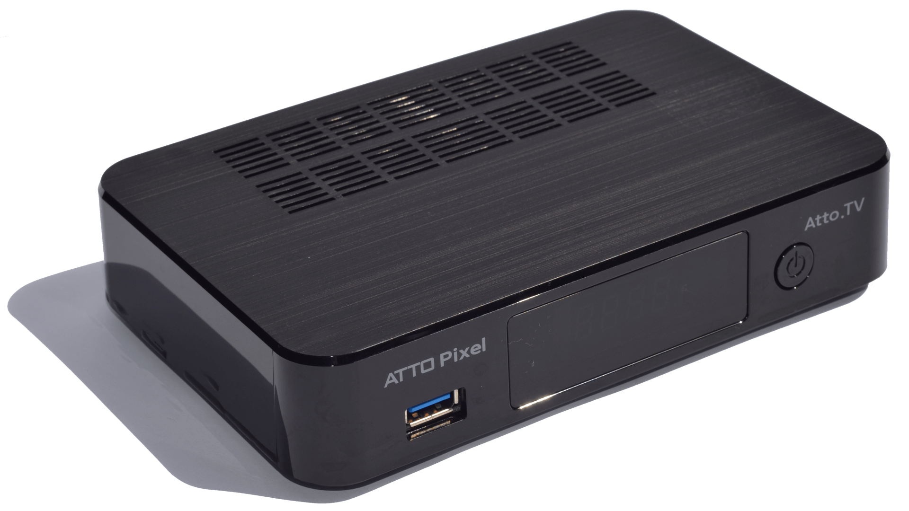

# Awesome Atto Pixel



# Menu

* [Ficha técnica do Pixel](#ficha-técnica)
* [Firmwares](#firmwares-para-o-pixel)
* [Downloads](#downloads)
* [Procedimento de atualização do firmware](#como-atualizar-o-firmware) 
* [Revendas](#revendedores-confiáveis)
* [Especificação técnica](#especificação-técnica-completa)
* [Comunidade - Fóruns de suporte,  WhatsApp e Telegram](#comunidade)
* [Cidades atendidas pelo IKaS Free](#ikas-free-atto---cidades-atendidas)
* [Vídeos](#vídeos-relacionados)
* [Debian Linux for Pixel](#debian-linux-for-pixel)
* [Enigma2 for Pixel](#enigma2-for-pixel)
* [FAQ - Perguntas frequentes](#perguntas-frequentes)


# Ficha técnica
- Versões: 
    - V1: com 3 tuners para tv a cabo - **4GB** de memória (NAND flash)
    - V2: com 3 tuners para tv a cabo (fixos) e opção de um tuner adicional: ISDB-T (terrestre) ou DVB-S/2 (satélite) - **8GB** de memória (NAND flash)
- Current firmware version: **2017-06-29** - [download](#firmwares-para-o-pixel)
- OSCAM Version: **OSCAM 30.1.17**
- Android version: **5.1.1** (Lollipop)
- [Android rooting](http://www.androidcentral.com/root): **SIM** (não oficial - [forum](https://freesatelitalhd.com/forum/index.php?topic=6926.0) - [download](https://mega.nz/#!gvIwDQSD!CSBfMmP5zbbZUh7ioAsfR0qu3vhvS9eGgi77u56630Q) - [instalação](#e-como-faço-para-rootear-colocar-em-modo-root-o-pixel))
- Kodi version: **16.1** 
- Kodi skin: **Confluence**
- Tuner para satélite - modelo: DVB-S2 ACM/CCM 
- Tuner terrrestre - modelos: SBTVD/ISBD-Tb (DVB-T)


# Sinal

- IKaS tv a cabo: funcionando sem problemas nas [regiões em que é disponiblizado](#ikas-free-atto-cidades-atendidas)
- KS alternativo: disponível em divesas regiões, mas não é tão estável quanto o IKaS
- CCSS: suportado
- IKaS Sat: ainda sem previsão
- SKaS: não suportado


# Downloads

### Firmwares para o Pixel
- **0724** (2017-07-24) - md5: f6f9d4e76fd5d19cf6b93cef9abc0918 - [download](http://ow.ly/cXTk30dXGll) - [link 2](http://ow.ly/4W6b30dXGiL) - [link 3](https://mega.nz/#!Yvw2QaSa!A-ibvHRMvHD2ZZog35rb21A2bI0RLg7_xUFu-ZinKac) - **NÃO OFICIAL** 
- **[0629](https://freesatelitalhd.com/forum/index.php?topic=7121.0)** (2017-06-29) - md5: f43d1b227da39aec65b0b40d16ae9569 - [download](http://ow.ly/vF1V30d7me4) - [link 2](http://ow.ly/M7UB30d7mwU) - [link 3](http://ow.ly/qiWF30d7mAS) - [link 4](http://ow.ly/AEth30d7wL0) - [changelog](https://freesatelitalhd.com/forum/index.php?topic=7121.0) 
- **0508** (2017-05-08) - md5: bd370abd42224ba444bca730fcf8e9f8 - [download](http://ow.ly/Zt2Q30bzcbq) - [link 2](http://ow.ly/1vE630bzcd4) - [link 3](http://ow.ly/nRIT30bzcfL) - [link 4](https://mega.nz/#!Yq5C1QIZ!R-oMRZoSCdfVCBrYVFplKwSPWD6-WiYL4zziRLSus0g) - [link 5](https://mega.nz/#!0hdBhQaR!sm21AZo5pm967Br4BdYr7uamaLlPCU9NnfF_gsJgVXY) - **OTA**
- **0421** (2017-04-21) - md5: b02a4da0935c9bed27603da180605e57 - [download](https://mega.nz/#!prAEQZqZ!zZ0wDezoYHATLJr0RBugfPcmS2akpAuRQqAjqD6-vkM) - [link 2](http://ow.ly/joab30b3umO) - [link 3](http://ow.ly/QK8P30b3vVU) - **NÃO OFICIAL**
- **0014** (2017-04-05) - md5: 70ad311294adb1bf221fefa87160aeab - [download](https://mega.nz/#!w3xgWIyI!DXB_Y6xAytJShOkbGGJXns6zayihxZVoBIc3a8FkehU) - **NÃO OFICIAL**
- **0013** (2017-04-01) - md5: 3eb7e9d81ef4c5d7bc258c04648bd438 - [download](https://mega.nz/#!YuZUSQDZ!7IrCfKZr9TNmcAX2drA6wKVouVjVz6qoU9srzikIYkk) - **NÃO OFICIAL**

### OSCAM
- **30.1.17.1 - service.softcam.oscam-30.1.17.1.zip** (2017-02-03) - [download](https://mega.nz/#!R2Jy3BZR!8UaJuKhe48VMWoP5xbnioTcqyQReDXN9PaFSBkhIV6I)
- **30.1.17.0 - service.softcam.oscam-30.1.17.zip**   (2017-02-03) - [download](https://mega.nz/#!U2AgxRzT!HJRsAf98poV40NebLpUAB5eEGigMXpfHQzNFv4KcjjI)
- **30.1.16.0 - service.softcam.oscam-30.1.16.zip**   (2017-02-03) - [download](https://mega.nz/#!onxmwbDR!vBtlgSF1BraSjnMOijl9BFzywahSJccmgPtsCzGUR3E)

### Android Root
- **0001** (2017-04-14) - [download](https://mega.nz/#!gvIwDQSD!CSBfMmP5zbbZUh7ioAsfR0qu3vhvS9eGgi77u56630Q) - **NÃO OFICIAL**

### Kodi for Pixel
- **0002 - 16.1** (2017-05-01) - [download](https://mega.nz/#!ZuYSEQwC!vSgxcRa-RO9FNhf3E9kZrs0J1876TXg8b2fBXJYCaBs) - [link 2](http://www3.zippyshare.com/v/HXoYIVF0/file.html) 
- **0001 - 16.0** (2017-04-01) - [download](https://mega.nz/#!huhDGZpQ!gtoqlzSQ_8qRLn80Xg77WVeJxdrc8vqVs_C5JwKz2h4) - **NÃO OFICIAL**

### Linux For Pixel
- **AttoPixelLinux-2.1.upk** (2017-08-15) - [download](https://mega.nz/#!sF8lxKwZ!jt5DJj0Db-RNMTNZf1BvSGs73gHCkmU-PhzYjiLfL_w)
- **linux.tar.xz** (2017-08-15) - [download](https://mega.nz/#!cAtECQQY!_ewjT4CObz6dQ0WG8tFBCUO8xtgVnBFo1kwyoascZJQ)

### Kodi Repositories
- **Atto Official Repository 0.0.3** (2017-04-01) - [download](https://mega.nz/#!pypEFBxA!ivQaj6YdrNeNu8Mih3ZcTIGA16H1DDJMlKno359iXN4)
- **Atto repository** [download](https://drive.google.com/open?id=0B5SEgLDAf1L7RG9IY0lqVVdGWGs)
- **Husham Repository 1.1.003** (2017-04-25) - [site](http://www.husham.com/husham-repo/) - [download](https://mega.nz/#!pqARTYIS!sF2QKaqcfF1VKHFnZ2ZKSFwX929NhlyomiMSjW-SVpk)
- **Torrent BR** - [download](https://drive.google.com/open?id=0B5SEgLDAf1L7bGR3eEtjRTV3S1U) - [link 2](https://mega.nz/#!Vr5CxJoL!hpQaId37BKkXMQMLAt2jecE2CkhBe66Jg2rAffoxz38)
- **Rogger 0.0.2** - [download](https://drive.google.com/open?id=0B5SEgLDAf1L7OTBqSm1pcjNaYUU) - [link 2](https://mega.nz/#!AjQgFDyb!Bo6BcxLy1F5CvN0Abb5Chw3PDviCMGf87hTxmPLKlGM)
- **Super Milton 0.0.2** (2016-06-28) - [download](http://supermilton.com.br/dev/repo/supermilton.repository-0.0.2.zip) - [link 2](https://mega.nz/#!UuZ0GTTI!TUCYrtoYZFyNxC6TL_d9NxbJq4D4dtsvBLaVmHtjGP0)
- **Maverick 1.3** (2017-05-01) - [download](https://drive.google.com/open?id=0B_-x_yqwMeQKMk43dnlxYUhLZ0U) - [link 2](https://mega.nz/#!c6BXyLbZ!vNho2ZuD19saDXmpAZtNsFc7ziV0HtnWDsJbS5mycHs)
- **Community Repository 9.9.5** - [official Page](http://thecommunityrepo.net16.net/zip/) - [download](http://thecommunityrepo.net16.net/zip/) [link 2](https://drive.google.com/file/d/0B_8JsjegwRNBbF9wS2VyODcwQU0/view) - [link 3](https://mega.nz/#!QuZkBJ6A!MQ5shrgc15aQv-JUvUt2imLvPR2nV-t4clFj_S26vDY)
- **Exodus 1.0.1** (2016-05-31) - [official Page](http://fusion.tvaddons.ag/kodi-repos/english/) - [download](http://fusion.tvaddons.ag/kodi-repos/english/repository.exodus-1.0.1.zip) - [link 2](https://mega.nz/#!5ypBkRxK!F6-_z10XlUQPxLoQSHzyLaLJ1c2tfCQoZJS-RFydvWo)

### Kodi Plugins
- **PlayList Loader - plugin.video.playlistLoader-1.0.9** (2017-04-25) - [download](https://mega.nz/#!UqJ0kK4a!kFrQ_2D3cnrQ-dsmAz2EgjTLuaY07FecImEj3zTpbLQ)
- **Brazuca Play 5.2 (sem ads) - plugin.video.brazuca.play-5.2** (2017-01-08) - [official Page](http://brazucaplay.forumbrasil.net/t18-play-downloads) - [download](http://bit.ly/BrPlaySemADS) - [link 2](https://drive.google.com/file/d/0B5SEgLDAf1L7ZTlCZjNoLWVMT1k/view) - [link 3](https://mega.nz/#!hrQkmYSA!BLQY6HQxt4hbxVkiQh72SohBtCX5En_zZ8kI_fvzpic)
- **Brazuca Play 5.1 - plugin.video.brazuca.play-5.1** (2017-01-08) - [official Page](http://brazucaplay.forumbrasil.net/t18-play-downloads) - [download](http://bit.ly/BrPlaydown) - [link 2](https://drive.google.com/file/d/0B5SEgLDAf1L7ZTlCZjNoLWVMT1k/view) - [link 3](https://mega.nz/#!YuQQFQbC!W8c98-O8wEQS8O3hQJ6TzXKj281Lky0V5Kv5vDPqxX0)
- **Brazuca Play 4.0 (18+)- plugin.video.+18play-4.0** (2017-01-08) - [official Page](http://brazucaplay.forumbrasil.net/t18-play-downloads) - [download](http://bit.ly/BR18Play) - [link 2](https://mega.nz/#!xzpAnbKZ!EXvhg8kUffOIOM6b6Q2wO2Svt9WA72dqXb7MwRGskUc)
- **Brazuca Play 2.0 - plugin.video.brazuca.play-2.0** (2017-01-08) - [official Page](http://brazucaplay.forumbrasil.net/t18-play-downloads) - [download](https://drive.google.com/file/d/0B5SEgLDAf1L7ZTlCZjNoLWVMT1k/view?usp=drivesdk) - [link 2](https://mega.nz/#!JuwjHLAb!t41seRGtf9btWm7u6ucVQUh_RSFk-eTDT_YZ1Z5ib90)
- **Sanctuary 0.6.7.5 - plugin.video.sanctuary-0.6.7.5** (2017-04-30) - [download](https://drive.google.com/open?id=0B_-x_yqwMeQKRDA3S1E3bDNPNnc) - [link 2](https://mega.nz/#!w3B3DDaB!1jk7oecI5MaoL6MVFYPLOOokGHWIayi-ZMP57JsDk5c)
- **Ares Wizard 0.0.57 - script.areswizard-0.0.57** (2017-05-05) - [official Page](http://repo.ares-project.com/plugins/script.areswizard/) - [download](http://repo.ares-project.com/plugins/script.areswizard/script.areswizard-0.0.57.zip) - [link 2](https://mega.nz/#!UuZ0GTTI!TUCYrtoYZFyNxC6TL_d9NxbJq4D4dtsvBLaVmHtjGP0)
- **Indigo 1.0.4 - plugin.program.indigo-1.0.4** (2017-03-31) - [official Page](http://fusion.tvaddons.ag/begin-here/) - [download](http://fusion.tvaddons.ag/begin-here/plugin.program.indigo-1.0.4.zip) - [link 2](https://mega.nz/#!onJUUT5C!78RkBr_Z-B2YwkMWGwTEMQQYzvkMX9Ma39CRgXhmnBU)
- **Specto 2016.02.06.3 - plugin.video.specto-2016.02.06.3** (2016-02-06) - [official Page](http://kodi.filmkodi.com/plugin.video.specto/) - [download](http://kodi.filmkodi.com/plugin.video.specto/plugin.video.specto-2016.02.06.3.zip) - [link 2](https://mega.nz/#!1y4l2A4S!5FqUX6lsZgqkvvPI_8KO3Y4NSSN3LHhwCUVLerJEVZ0)
- **Lembretes (PVR reminder) 2017.07.31.0 - service.pixel.lembretes** (2017-07-31) - [official Page](https://github.com/josemoraes99/pixel.lembretes/) - [download](https://github.com/josemoraes99/pixel.lembretes/raw/master/service.pixel.lembretes.zip) - [link 2](https://mega.nz/#!FnIQxITb!0BhV74DUyt1EnuLzYNuYWvRLpGgQkzmtpW97_i-9MQQ)

### Apps for Android
- **Netflix 4.16 build 200147** (2017-05-20) - [download](https://mega.nz/#!cnpzFSAA!bZkq8ewpP0C1bZCKh26GmG73xa_BBXSjxhmeGdScI_A)
- **Vizer 2.1.0** (2017-04-01) - [info](https://www.edtuttors.com/vizer-v2-1-apk-aplicativo-para-assistir/) - [download](https://mega.nz/#!hnBURBqA!v7lz8KUkdmDC9ZBAur0lyzzUvxYfqWuD8vRJwWE2XDs)
- **Spotify For AndroidTV 1.3.1** (2017-05-30) - [apkmirror](http://www.apkmirror.com/apk/spotify-ltd/) - [download](https://mega.nz/#!IyAB0BRQ!vSzFinsRwQbuOBeggNg1YxDRXjpVE9VBToZX8v1Ry64)
- **Spotify 8.4.4** (2017-05-30) - [apkmirror](http://www.apkmirror.com/apk/spotify-ltd/) - [download](https://mega.nz/#!tuJV2IBI!Vn5tSosHBURXiTTs4IjXuppxVCIj-Pq_G00qq_REMKU)

### Enigma2

2017-08-25 - [EM BREVE]

# Debian Linux for Pixel
Que tal rodar um LINUX completo dentro do seu Android?

## Tópico oficial no Fórum
Caso queira discutir o assunto ou deixar algum comentário para o desenvolvedor, entre em [[DUAL SYSTEM] Android + Debian 8.x (FS)](https://freesatelitalhd.com/forum/index.php?topic=7250.0).

## O Linux inclui
- Debian 8.0
- Transmission
- Plex
- SSH

Não bastou? Use o comando **apt-get install <programa>** pra instalar o que mais quiser!

## Requisitos
- Um cartão SD ou qualquer dispositivo de armazenamento via USB (HD, Pendrive...)
- Formatar o dispositivo em EXT4 (EXT2 e EXT3 também suportados).
- Aplicar a atualização "[AttoPixelLinux.upk](#linux-for-pixel)" no seu Atto Pixel.

OBS: Essa atualização server apenas para inicializar o Linux ou instalá-lo caso seja necessário, só é preciso reaplica-la caso seja atualizado o sistema.

## Como instalar
- Baixe o arquivo "[linux.tar.xz](#linux-for-pixel)" e coloque na pasta raíz (root) do dispositivo USB já formatado.
- Insira-o em seu receptor e depois reinicie.
- Quando o receptor iniciar, será iniciado o processo de instalação em background (não tem notificação). Atenção, este é um processo demorado e irá levar alguns minutos, enquanto isso pode utilizar o aparelho normalmente mas não pode desligá-lo. 
- Para acompanhar o processo, você pode acessar o aparelho via compartilhamento remoto (SMB) e ver o log (arquivo linux-install.log) que é gravado na mesma pasta do arquivo linux.tar.xz. 
- Se o arquivo linux.tar.xz for apagado, significa que deu tudo certo e que **você agora tem um Linux rodando ao mesmo tempo que o Android do Pixel!**
- Caso o arquivo linux.tar.xz não tenha sido apagado, alguma coisa deu errado, por favor verifique o arquivo **linux-install.log**

## Como acessar
 
### Acesso SSH
- Usuário: root
- Senha: AttoPixel

### Transmission
- URL: http://IP_DO_SEU_RECEPTOR:9091/
- Usuário: atto
- Senha: AttoPixel

### Plex
- URL: http://IP_DO_SEU_RECEPTOR:32400/web/


# Enigma2 for Pixel

### Instalando

- Baixe o arquivo IMG compactado em [Downloads](#enigma2)
- Instale a última atualização ([0724](#firmwares-para-o-pixel)), **apenas esta versão de firmware suporta o Enigma2**.
- Aplicar o IMG no SDCard utilizando o [Win32DiskImager](https://sourceforge.net/projects/win32diskimager/) ou usando o comando [dd](https://www.howtoforge.com/linux-dd-command/) no linux.
- Colocar o SDCard no Pixel.
- Desligar e ligar o Pixel.
- Ao ligar o Pixel irá aparecer MENU no visor, então você terá menos de 1 segundo para selecionar o sistema operacional:
    - Android - Tecla Vermelha
    - Enigma2 - Tecla Azul
- A escolha ficará como padrão, então não precisa ficar selecionando a cada desligamento ou reboot do sistema.

### IP do Pixel

Para usar a maioria dos serviços, você vai precisar do IP do Pixel, verifique no seu roteador qual é. Nos exemplos abaixo vamos usasr o IP 192.168.0.10.

### EPG

Para habilitar a atualização automática do EPG, siga os seguintes passos:

- Menu > Plugins > EPG Importer 
- Habilitar o plugin 
- Habilitar o source "Brasil 15 dias online" 
- Desabilitar todos os outros sources
- Salvar (tecla verde)
- Apertar a tecla amarela para fazer a primeira carga manual

Para ter um EPG gráfico, mais "bonito": 
  - Menu > Setup > EPG > GraphicalEPG settings
  - View mode: mudar de text para para graphics
  - Salvar (tecla verde)

Baixando um EPG e tema melhor:

  - Baixar https://github.com/openatv/MetrixHD/tree/master/usr
  - Copiar a pasta /usr/share/enigma2 para a mesma pasta no Enigma2

### SSH

Entre usando o PuTTY ou qualquer outro cliente ssh:

- IP: 192.168.0.10
- Porta: 22

### OSCAM

Para acessar use a URL: http://192.168.0.10:8081

Caso ele não entre:

- Acesse o Pixel via SSH
- Execute o comando: `ps aux | grep oscam` ou `top -bn1 | grep oscam`, caso não apareça um processo de `oscam`, provavelmente ele não foi iniciado corretamente.

### Streaming

Você vai precisar configurar o acesso para o OpenWebif, onde você consegue pegar os links (urls) dos arquivos `.m3u` para os canais. Essas urls podem ser usadas em programas tais como o VLC.

### OpenWebif

Configure o acesso a ele:

- Vá em Menu > Plugins > OpenWebif
- Configure a porta (ex: 8082)
- Habilite o acesso HTTP
- Use um browser para acessar a URL http://192.168.0.10:8082.

### Acesso SMB e FTP

O acesso SMB está configurado e testado, o acesso FTP ainda não foi testado.

### Observações técnicas

- Não funciona com IKaS, apenas com CS.
- É uma versão ALPHA, algumas coisas podem não estar funcionando, use por sua conta e risco.

### OPKG

O gerenciador de pacotes OPKG está disponível para instalar e atualizar pacotes. Comandos básicos

```
opkg list
opkg install <pacote>
```

Caso o pacote não seja encontrado, tente instalar um outro conjunto de feeds em `/etc/opkg`, aqui temos alguns exemplos:

- Arquivo de feeds: [feeds.conf](enigma2/etc/opkg/feeds.conf)
- Arquivo de arquiteturas: [arch.conf](enigma2/etc/opkg/arch.conf)

### Update script

Para fazer pequenas atualizações ou de toda a distribuição, você pode usar o script [update-enigma2.sh](update-enigma2.sh)

Divirta-se!

# Revendedores confiáveis
O preço médio do equipamento gira hoje entre R$ 560 (menor preço encontrado) e R$ 700.
### São Paulo (entrega em todo o brasil por Sedex) 
- [IPTVIP](http://www.iptvip.com.br/) 
- [KADU SAT](http://www.kadusat.com.br/) - [Loja Online](https://www.saccinishop.com.br) - tel/zap: [19-98119-9738](whatsapp://+5519981199738)
- [HK Mania](mailto:hkmania@hotmail.com) - tel/zap: 11-98544-6379 - fixo: 11-3225-0829 (Elizabeth, Carol ou Houssen) 
    - R. Aurora, 200 lj 228 - S. Ifigênia 


# Comunidade 
### Fóruns de suporte
- [Open HD Forum - Pixel](http://freesatelitalhd.com/forum/index.php?topic=6898.225#lastPost)
- [Open HD Forum - Pixel - Android rooting](https://freesatelitalhd.com/forum/index.php?topic=6926.0)
- [Open HD Forum - Status IKaS](http://freesatelitalhd.com/forum/index.php?board=21.0)
### Grupos de WhatsApp e Telegram
- Atto Pixel Oficial - [convite - WhatsApp](https://chat.whatsapp.com/KtJGxvU6dck4p0WBxmai3g)
- Atto Desenvolvedores - [convite - WhatsApp](https://chat.whatsapp.com/1SfWUhMFAkCCRCEnnhkCzz)
- Android Média Center - [convite - WhatsApp](https://chat.whatsapp.com/IHwKOpZLxWICLUyBW3qCDF)
- Android Mídia Center - [convite - Telegram](https://t.me/joinchat/AAAAAD_UHoVSkO-UFX2IBA)
- CineClub - [Telegram Channel](https://telegram.me/AppCineClub) 

# IKaS Free Atto - Cidades atendidas
As cidades não listadas não têm suporte a IKaS Free

#### São Paulo - SP
- São Paulo, Araçatuba, Atibaia, Barueri, Campinas, Carapicuíba, Cotia, Diadema, Franco da Rocha, Guarulhos, Itapevi, Itaquaquecetuba, Jandira, Jundiaí, Mauá, Mogi das Cruzes, Osasco, Presidente Prudente, Santo André, Sorocaba, Samuré, Suzano, São Bernardo do Campo, São Cateano do Sul e Taboa

#### Rio de Janeiro - RJ
- Rio de Janeiro (Grande Rio, incluindo Pechincha), Duque de Caxias, Nova Iguaçú, Seropédica, São Gonçalo, Niterói e Rio das Ostras  

#### Paraná - PR
- Curibita, Colombo, Campo Largo, Almirante Tamandaré, Araucária, São josé dos Pinhais, Rio Branco do Sul

#### Rio Grande do Suk - RS
- Porto Alegre e Canoas


# Vídeos relacionados
- [Unboxing](https://www.youtube.com/watch?time_continue=2&v=cjdZ_eUyIZ8)
- [Busca de canais por NIT](https://www.youtube.com/watch?v=_tF5DPvvc6M)
- [Demo da troca de canais](https://www.youtube.com/watch?v=FF5fY26EAr8)
- [Video On Demand](https://www.youtube.com/watch?time_continue=2&v=vJwYPq_yLFc)
- [Instalando o Atto Play](https://www.youtube.com/embed/riSJ7pjLRNk)
- [Como ativar OSCAM para status IKS e CS](https://www.youtube.com/watch?v=Og6InLpaljE)
- [Busca dos canais](https://www.youtube.com/watch?time_continue=3&v=8XeIl1Vq85Y)
- [Bloqueando canais](https://www.youtube.com/watch?v=Nhr7bpvDI28)
- [Criando atalhos](https://www.youtube.com/watch?v=UytOZD1FYio)
- [Configurar controle remoto](https://www.youtube.com/watch?time_continue=2&v=tccymDTsJmU)
- [Asistindo no celular/tablet (somente android - ainda não disponível para o Pixel)](https://www.youtube.com/watch?time_continue=2&v=Mutzpt02pMY)
- [Instalando apk 'App' por USB](https://www.youtube.com/watch?v=c7_hFccaPcA)
- [Instalando Picons (logos dos canais)](https://www.youtube.com/watch?v=Ol5kjDoym60)
- [Usando o PlaylisTV](https://www.youtube.com/watch?v=0LMqnU1i-ew)
- [Como Instalar o Playlist Loader](https://youtu.be/l1pjQ94dAf8)
- [Como resolver problemas do Playlist Loader](https://youtu.be/gTRYTq8x0X0)
- [Obtendo um melhor desempenho de rede no Kodi](https://www.youtube.com/watch?time_continue=1&v=uPo3TNMY7hA)
- [Aumentando o buffer de rede do Kodi](https://www.youtube.com/watch?time_continue=1&v=uPo3TNMY7hA)
- [Usando o ES File Explorer para transferir arquivos](https://www.youtube.com/watch?v=ZDZS1f2GtLw)
- [Demonstração da função On-Demand](https://www.youtube.com/watch?v=vJwYPq_yLFc)
- [Adicionando Aplicativos (arquivos .apk) via USB](https://www.youtube.com/watch?v=_q1J9GWjXlA)
- [Adicionando Addons no Kodi](https://www.youtube.com/watch?v=WfE9uuQN1_g)
- [Vídeo 4k - Tutorial + uso do PlaylisTV](https://www.youtube.com/watch?v=0LMqnU1i-ew&t=77s)
- [Kodi Livres de Erros e Ares Wizard](https://www.youtube.com/watch?v=tgVdvFI7gPM&feature=youtu.be)
- [Como Resolver problema de Mute no KODI (sem som)](https://youtu.be/uwE8Sm6IAV0)

# Perguntas frequentes
### O Pixel é realmente 4K?
Sim

### O Pixel funciona com qualquer TV ou apenas as 4K?
Sim, há relato de gente usando em TV 720p (1.280 x 720 pixels). Isso significa que ele vai funciona em TVs 1080i e 1080p também, além das 4K.

# Como atualizar o firmware
Os itens abaixo devem ser seguidos passo-a-passo:

- Para redefinir o Android para as configurações de fábrica, faça:
    1. Home (tecla "casinha") 
    1. Settings 
    1. Fazer backup e redefinir 
    1. Configuração original
    1. Redefinir tablet
    1. Apagar tudo

- Ligue e desligue o aparelho

- Para atualizar usando o arquivo de update "update-atto-pixel-v00XX.upk", faça:
    1. Coloque o arquivo em um pendrive (ou HD USB) e plugue na USB do aparelho
    1. Home (tecla "casinha") 
    1. Media Center
    1. Store
    1. USB3.0
    1. Vá até o arquivo e clique OK
    1. Responda YES para a pergunta "Do you want to upgrade ?"

- Reinicie mais uma vez, se ele não fizer isso sozinho e o Kodi deve voltar ao normal

- Instale TODOS os add-ons no repositório "Atto Pixel 4K Repository":
    1. Live TV (tecla "televisão com antena")
    1. Sistema
    1. Ajustes
    1. Add-ons (EXIT até não aparecer mais ".." no menu)
    1. Instalar via repositório
    1. "Atto Pixel 4K Repository"
    1. Instalar todos os add-ons em cada categoria.

### Como faz pra instalar o Atto Play?
Esse [post](https://freesatelitalhd.com/forum/index.php?topic=6229.msg128632#msg128632), do @leandrotsampa, explica como instalar e tem muitas informações. [Este vídeo](https://www.youtube.com/embed/riSJ7pjLRNk) também é uma excelente referência. Basicamente:
 
### O Pixel está dando "tela preta" e alguns comandos param de funcionar
Normalmente isso é um problema do Kodi e não do Pixel. Quando falta espaço em disco no Kodi. Pra ter certeza, reinicie o Pixel, entre em Sistema > Informações sobre o sistema (menu debaixo da opção) > Armazenamento e veja se o /storage/sdcard está cheio. Se estiver você vai ter que liberar espaço pro Kodi. 

### Os tuner para tv a cabo funcionam juntos com o tuner ISDB-T ou DVB-S/2?
Sim. Instale o novo tuner (DVB-S/2 ou ISDB-T), que deverão aparecer 4 tuners na busca ao invés de 3.

### O Pixel já vem com tuner para satélite ou terrestre?
Não, os tuners satélite e ISDB-T são vendidos separadamente, entre em contato com a loja que vendeu o Pixel para maiores informações.

### Posso usar os 3 tipos de tuners no mesmo Pixel?
Não, os tuners para tv a cabo são fixos 
Não, os tuners satélite e ISDB-T são vendidos separadamente, entre em contato com a loja que vendeu o Pixel para maiores informações.

### Como eu faço para liberar mais espaço para o Kodi?
A maneira mais fácil é transferir/mover todos os dados do Kodi para outro disco. Este tutorial ensina como fazer: http://kodi.wiki/view/HOW-TO:Change_data_location_for_Android. 

Segue o passo-a-passo:

1) Feche o Kodi.

3) Crie uma pasta para os dados do Kodi dentro do novo dispositivo, exemplo:

```
/mnt/mmcblk1/mmcblk1p1/kodi
```

4) Crie o arquivo `/mnt/sdcard/xbmc_env.properties` (no root do Android) com o seguinte conteúdo:

```
xbmc.data=<pasta aonde vai ficar o Kodi no cartão SD ou disco USB>
```
    
Exemplos:

```    
xbmc.data=/mnt/mmcblk1/mmcblk1p1/kodi/data
```

```    
xbmc.data=/mnt/sda/sda1/kodi/data
```

3) Mova (ou copie) todo o conteúdo de `/mnt/sdcard/Android/data/org.xbmc.kodi/.kodi` para a nova pasta `/mnt/mmcblk1/mmcblk1p1/kodi` (exemplo).

5) Reinicie o Kodi

### Para que serve o "modo root"?
'Em sistemas operacionais com base no Unix/Linux, como o Android, o root representa a possibilidade de se utilizar a plataforma como um superadministrador. Isto significa que um aparelho "rootado" tem acesso total ao sistema, sendo capaz de realizar funções e de acessar aplicativos que não estão disponíveis quando ele está "fechado"...'

O texto acima é parte do artigo publicado na [TechTudo](http://www.techtudo.com.br/artigos/noticia/2013/07/para-que-serve-o-root-do-android-saiba-se-vale-pena-fazer.html). 
Outro bom artigo na [Android Central](http://www.androidcentral.com/root).

### É possível colocar o Pixel em "modo root"?
Sim, ele é um Android exatamente igual a outros. Oficialmente ainda não existe, mas há um [arquivo não oficial](#ficha-técnica) disponível.
 
### E como faço para "rootear" (colocar em "modo root") o Pixel?
- Baixe o [arquivo](#ficha-técnica) e salve ele na raiz de um pendrive ou HD usb. "RAIZ" signfica que você não deve colocar dentro de nenhuma pasta;
 
- Plugue o drive na porta USB **frontal**;
                        
- Selecione o arquivo, indo em: 
    1. Media Center 
    1. Store 
    1. [Selecione o seu drive] 
    1. Clique no arquivo de root que você colou nele
    
- Ele vai perguntar se você quer realizar update, clique em "YES";

- O Pixel vai rebootar e o Android (robô verde) vai aparecer na tela, aguarde a reinicialização completa;

- Vá em aplicativos e execute o **supersu**;

- Ele vai dizer que precisa atualizar o binário, clique em "SIM" e "NORMAL";  

- Aguarde a atualização e aceite a nova reinicialização;

- O root deverá estar estar feito.

### Aonde estão as atualizações oficiais?
Ainda não foram publicadas oficialmente.

### KS Alternativo está disponível?
Ainda não, mas há previsão.

### Como faz pra habilitar os menus de filmes e seriados no Kodi?
Vá em videos, crie as fontes de seriados e filmes, que o Kodi vai habilitar os menus automaticamente.

### Como instalo os Picons (logo do canal de tv)?
Veja na seção de vídeos relacionados

### Quantos sintonizadores de canais possui?
Ele tem 4 ao todo, permitindo você usar 4 canais diferentes simultaneamente, com apenas uma entrada física. Em teoria você pode gravar dois canais enquanto assiste um na TV e outro no celular.

### Quantos modelos de Pixel vão existir?
Apenas 1

### Tem opção de colocar tuner terrestre, para TV Digital via UHF?
Sim, terá no futuro, mas não vem com o produto. Será necessário comprar uma placa separada, que ainda não está sendo vendida. O tuner principal vem soldado na placa, o tuner opcional será adicionado a esta mesma placa e será vendido com o espelho traseiro.

### Eu posso ver TV direto do Kodi?
Sim

### CS está disponível?
Sim

### IPTV está funcionando?
Ainda não

### A atualização será automática ou terei que baixar arquivo?
A atualização será automática (OTA - Over The Air), mas esta funcionalidade ainda não está pronta, atualmente (abril de 2017) em fase de testes.

### Quantos GB o cartão SD suporta?
Há relato de cartão de 128GB rodando. Como ele suporte cartões SDXC, o limite teórico deve ser 2TB:
- SD High Capacity (SDHC™) Plástico is an SD™ memory Plástico based on the SDA 2.0 specification.
  SDHC capacities range from 4GB to 32GB
- SD Extended Capacity (SDXC™) Plástico is an SD™ memory Plástico based on the SDA 3.0 specification.
  SDXC capacities range from 64GB to 2TB

### A gravação pode ser feita tanto em HD quanto em cartão SD?
Sim

### Como colocar senha para nos canais adultos?
Veja na seção de vídeos: [Bloqueando canais](#videos-relacionados)

### Alguns canais (ou todos) não estão pegando aqui, como posso resolver?
Comece vendo no fórum de [status dos IKaS](#fóruns-de-suporte). E verifique o seguinte:
- Tenha certeza **absoluta** de que o sinal de TV está chegando pra você. Muitas vezes a gente só descobre depois que o problema estava no prédio, ou no bairro. Mesmo que você tenha telefone, talvez não tenha TV, verifique.
- Verifique se os cabos estão bem conectados, e se o divisor, se houver, não deu algum problema.
- Ligue o cabo no receptor original e veja se está tudo bem com os canais.
- Se você está usando CS, veja com o seu servidor.
- Se no fórum ninguém reportou o problem a ainda, reporte você e aguarde comentários.

### A PlayStore não funciona comigo, o que eu faço?
Veja nos seus aplicativos do Android se está instalado o Google Play Service, ele é fundamental para a PlayStore funcionar.

### Como faço para abrir o Plugin Ares no Pixel?
Instale a versão atual (0.0.57), execute normalmente e saia da TV (pra ele desligar o pvr), abrindo um filme ou um seriado, por exemplo, que a tela do Ares vai aparecer. Normalmente ele demora pelo menos uns 15 segundos, mas no Pixel é necessário sair da TV também.

# Especificação técnica completa
- [Full tech specs - do fabricante](https://atto.tv/pixel/specs/)

### Atualização
- Atualização OTA (Over The Air, **em testes**), ou pelo pendrive com o uso do navegador embutido.

### Peso e dimensões do aparelho
- Peso do aparelho: 280 gramas
- Com caixa: 890 gramas
- Dimensões: 115 x 175  x 35 (L x W x D)

### Memoria e Armazenamento
- 4GB High speed i.NAND Flash (120 MB/s)
- 2GB Memoria RAM (10667 MB/s)
- 2 Portas USB 3.0 para HD Externo (NTFS/exFAT/ext4/FAT32) velocidade até 5 Gb/s cada
- 1 Porta LAN/WiFi como cliente NAS, SMB/CIFS, Samba, Windows Grupo Doméstico
- 1 Slot T-Flash até Micro SDXC Classe 10

### Processador
- 64-bit
- Quad-core 64-bit high-performance ARM Cortex A53, 15000 DMIPS
- Integrated multimedia acceleration engine NEON
- Hardware Java acceleration
- Integrated hardware floating-point coprocessor

### 3D GPU - Unidade de Processamento Gráfico
- High-performance multi-core GPU Mali T720
- OpenGL ES 3.1/3.0/2.0/1.1/1.0 OpenVG 1.1
- OpenCL 1.1/1.2 Full Profile/RenderScipt
- Microsoft DirectX 11 FL9_3
- Adaptive scalable texture compression (STC)
- Pixel fill rate greater than 2.7 Gpixel/s

### Conectividade
- 1x Porta LAN até 1 giga bits por segundo
- 1x Wireless WiFi 802.11b/g/n com antena planar embutida (Melhor ganho)
- 1x Bluetooth até 4.0 Dual mode (V2.1+EDR/BT v3.0/BT v3.0+HS/BT v4.0)
- Bluetooth aceita Joystick, Alto falante, teclado, mouse, fone de ouvido.

### Qualidade e Saídas de Vídeo
- Qualidade 4K HDR (High Dynamic Range 10-bits) Dolby Vision
- Saídas 4K x 2Kp60/4K x 2Kp30
- Aspecto Relación de 4:3 o 16:9, relacion de aspecto forzosa conversion, escala y libre.
- Maior variedade de cores se encontram as recomendações BT.2020 Cor Avançada
- Mecanismo de processamento de Imprex 2.0 com HDR, aumentando as taxas de contraste de cor para proporcionar uma qualidade de imagem mais realista
- 10 bits por cor, de uma profundidade maior de bits e uma gama mais ampla de cores significa tons de cor mais finas, as smoothers transições de luz para escuro

### Vídeos decodificados (HiVXE 2.0 Processing Engine)
- H.265/HEVC Main/Main10 profile@level 5.1 high-tier, maximum 4K x 2K@60 fps and 1x1080p@30 fps simultaneous decoding
- H.264/AVC BP/MP/HP@level 5.1; H.264/AVC MVC, maximum 4K x 2K@30 fps decoding
- VP9, maximum 4K x 2K@60 fps decoding
- VP6/8, maximum 1080p@60 fps decoding
- MPEG1, maximum 1080p@60 fps decoding
- MPEG2 SP@ML, MP@HL, maximum 1080p@60 fps decoding
- MPEG4 SP@level 0−3, ASP@level 0−5, GMC, short header format, maximum 1080p@60 fps decoding
- AVS baseline profile@level 6.0, AVS-P16 (AVS+), maximum 1080p@60 fps decoding
- VC-1 SP@ML, MP@HL, AP@level 0−3, maximum 1080p@60 fps decoding

### Codificação e decodificação de Áudio
- Dolby AC-4
- Interfaces audio-izquierda y audio-derecha na saída Interface CVBS
- MPEG L1/L2
- Dolby Digital / Dolby Digital Plus decodificador-Converter
- DTS HD and DTS M6 decoding
- Descodificación AAC-LC y HE AAC V1 / V2
- APE, FLAC, Ogg, AMR-NB, and AMR-WB decoding
- G.711 (u/a) audio decoding
- Dolby MS12 decoding and audio effect
- HE-AAC transcodificación DD (AC3)

### Graphics and Display Processing (Imprex 2.0 Processing Engine)
- HDR
- Superposição de hardware de gráficos e entradas de vídeo multicanal
vTecnologia de extensão de resolução super (para melhorar a reprodução de vídeo através da rede)
- Multi-tap escala vertical e horizontal de vídeos e gráficos; Escala livre
- Conversão de espaço de cor (CSC) com coeficientes configuráveis
- Ajuste de crominância, luminância, contraste e saturação
- Processamento e exibição de vídeo 3D de formato completo
- Mecanismo bidimensional full-hardware aprimorado (TDE)
- Completo hardware anti-aliasing y anti-parpadeo
- Cuatro capas OSD
- Tres capas de vídeo
- O espelhamento de tela
- Processamento de vídeo de ultra-baixo atraso
- Processamento de vídeo Db / Dr
- Melhoria e remoção de imagem

### Entradas e saídas
- 1x Cabo IN Tipo F Conector fêmea que suporta 4 travas DVB-C / C2
- 1x Cabo IN F Tipo Conector fêmea que suporta 1 bloqueio (Opção) SBTVD
- 1x HDMI 2.0a TX com saída HDCP 2.2, máximo 4K x 2K @ 60 fps
- Interfaces de vídeo analógico: uma interface CVBS
- 2 portas USB 3.0 host, compatível com USB 2.0
- 1x slot T-Flash (MicroSD)
- 1x RJ-45 para conector 8P8C 10/100/1000 Mb/s Ethernet port
- 1x Jack J4 até 12V 3A Max ("Universal")


### Streaming
- AirPlay
- UPnP/DLNA
- MiraCast
- Google Play
- Roda NETFlix
- Sling TV
- Pandora
- Spotify
- Deezer
- Telecine Play
- Amazon Prime
- CS de IPTV
- Claro Video
- Globo Play

### Interatividade
- Controle remoto infravermelho de qualidade top, conveniente e agradável ao toque
- Aceita mouse e teclado sem fio com adaptador USB ou diretamente via Bluetooth
- Aceita mouse e teclado con fio na porta USB
- Tela de Android fácil de reconhecer por usuários de Smartfones
- Launcher fácil, agradável e descomplicado
- Aceita Air Mouse com Teclado (tipo controle do X1) e comando de voz
- Aceita Joystick sem fio Bluetooth e com cabo USB
- 10-foot user interface com Kodi. Fácil de aprender e usar.
- Controle pelo celular ou tablete com Kore (Kodi) e/ou HITVRemote

### Energia
- CPU de baixo consumo de energia
- Voltagem de entrada: 12V DC 2A MAX
- Tipo de fonte SMPS: Adaptador Fonte Universal 110/220V 50/60Hz Max 0,5A
- Tipo de plugue da fonte: NBR 14.136
- Consumo de energia: Max 5 W e mínima de 30 mW (0,003 W)
- Processador de espera integrado, suportando vários modos de baixa potência e menos de 30 mW de consumo de energia em modo de espera
- Design de baixa potência, como dimensionamento de voltagem adaptativa (AVS) e escalonamento dinâmico de tensão e freqüência (DVFS)

### Recepção
- DVB-C/C2
- SBTVD/ISBD-Tb (DVB-T) Faixa completa (opcional)
- IPTV Streaming h265/VP9/h264
- DVB-S2 ACM/CCM (Opcional compra separada)
